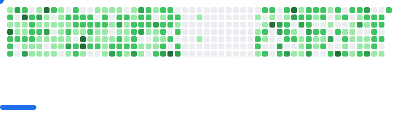

<!-- Enhanced GitHub Profile README with Visual Elements -->

<!-- Banner -->

  

<!-- Typing Animation -->

  
  
  <!-- Profile views counter -->
  

---

## 🚀 About Me

> *"The best way to predict the future is to invent it."* — Alan Kay

🔎 **Software Engineer** passionate about creating innovative solutions and building amazing applications. My journey spans from competitive programming to full-stack development, always driven by curiosity and the desire to build something meaningful.

### 🎯 Currently Focused On:
- 💻 **Full-Stack Development** — Building scalable web and mobile applications
- 📱 **Mobile Development** — Flutter & Android development
- ☁️ **Cloud Technologies** — Firebase and modern backend solutions
- 🏆 **Competitive Programming** — Always problem-solving

### 📈 Quick Stats:

  

  

---

## 💻 Tech Stack

  
### 🚀 Languages & Frameworks

### 📱 Mobile & Web Development

### ☁️ Cloud & Database

### 🛠️ Development Tools

  

---

## 📊 GitHub Analytics

  
  
  
  

  
  
  

  
  
  

---

## 🏅 Competitive Programming Journey

  
| Platform | Profile | Achievements |
|:---:|:---:|:---:|
| 💻 **[LeetCode](https://www.leetcode.com/shourya_freakin)** | shourya_freakin | Active Problem Solver |
| 🔥 **[Codeforces](https://codeforces.com/profile/devpool)** | devpool | Regular Contestant |
| ⭐ **[CodeChef](https://www.codechef.com/users/shouryagupta13)** | shouryagupta13 | Competitive Programmer |
| 🧠 **[GeeksforGeeks](https://auth.geeksforgeeks.org/user/shoury9ghf)** | shoury9ghf | Problem Solving Enthusiast |
  

---

## 🌐 Connect With Me

  
### 💬 Let's Build Something Amazing Together!

*Open to collaborations, exciting projects, and meaningful conversations!*

Whether you're looking to discuss the latest in technology, need a development partner, or just want to chat about programming — I'm always excited to connect with fellow developers and innovators.

### 📫 Reach Me At:

  

---

  
### 🚀 Always Learning, Always Building, Always Growing

*"Code is like humor. When you have to explain it, it's bad."* - Cory House

⚡ **Fun fact:** I am Tech-Savvy 👨‍💻
  

  <picture>
    <source
      media="(prefers-color-scheme: dark)"
      srcset="images/breakout-dark.svg"
    />
    <source
      media="(prefers-color-scheme: light)"
      srcset="images/breakout-light.svg"
    />
    
  </picture>

  

